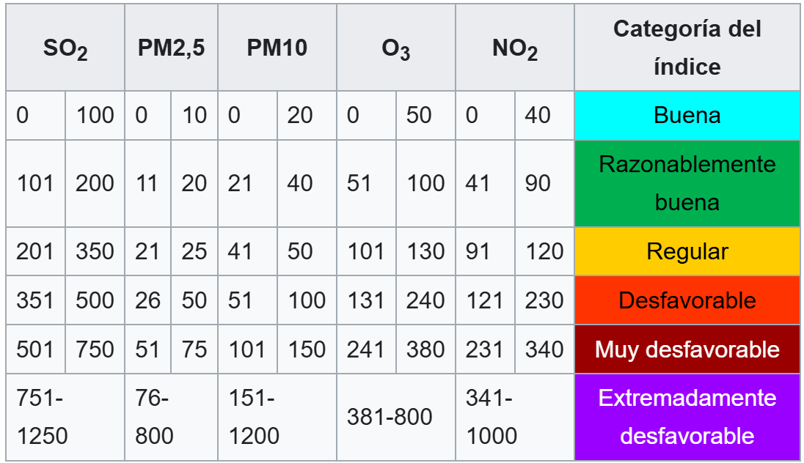

```{r setup, include=FALSE}
knitr::opts_chunk$set(echo = FALSE, warning = FALSE,message = FALSE,fig.asp = 0.7,out.width = "75%", fig.align = "center")
```

# Introducción

## Contexto y Objetivos del Proyecto

La calidad del aire es un determinante clave de la salud pública urbana.
Este proyecto realiza un Análisis Exploratorio de Datos (AED) para comprender sus patrones en Valencia.
El análisis requiere primero consolidar y limpiar un complejo conjunto de datos de múltiples fuentes en un dataset fusionado.
Posteriormente, se deriva el Índice de Calidad del Aire (ICA) Europeo para analizar y visualizar sus patrones espaciales, temporales y estacionales.
Finalmente, se identifican y correlacionan los factores explicativos, tanto meteorológicos como de origen humano (tráfico), que influyen en los episodios de buena y mala calidad del aire.

## Fuentes y Descripción de los Datos

Para alcanzar los objetivos, este estudio considera dos fuentes principales de datos:

-   El histórico de datos de calidad del aire del periodo 2004-2022, proveniente del portal de datos abiertos del Ayuntamiento de Valencia (`rvvcca.csv`).

-   Los datos más recientes por estación, desde 2023 hasta agosto de 2025, obtenidos del portal de datos históricos de la GVA.

Los datasets incluyen un amplio espectro de variables: $PM_{10}$, $PM_{2.5}$, $NO_2$, $O_3$, $SO_2$, $NOx$, $C_6H_6$, Temperatura, Velocidad del viento, Dirección del viento, Precipitación, Radiación Solar, Presión, etc.

El propósito es unificar todas las fuentes de datos heterogéneas en un único dataset consolidado y coherente.
Esto permite trabajar de forma integrada con información desde 2004 hasta 2025, asegurando consistencia en nombres de variables, formato de fechas y estructura de columnas.

# Metodología: Consolidación y Limpieza de Datos

## Fusión de Múltiples Fuentes

### Carga de librerías

El primer paso es cargar los paquetes fundamentales para manipular los datos y limpiar el entorno de trabajo.

```{r}
rm(list=ls())
library(dplyr) # Para manipular dataframes: filtrar, renombrar, unir, etc.
library(lubridate) # Para trabajar con fechas: funciones como dmy(), ymd(), etc.
library(readr) # Lectura de archivos `.csv` 
library(tidyr) # Para transformar dataframes entre formatos ancho y largo
library(ggplot2) # Para visualización de datos
library(patchwork) # Para combinar múltiples gráficos ggplot2
library(ggcorrplot) # Para gráficos de matrices de correlación
library(naniar) # Para visualización y manejo de datos faltantes
library(imputeTS) # Para imputación de valores faltantes en series temporales
```

### Carga y lectura de los datasets

El primer paso del preprocesamiento fue la carga del dataset histórico, que contiene los registros del periodo 2004-2022.

Una vez cargado, se realizó una limpieza inicial para facilitar su manejo.
Esta incluyó la estandarización de los nombres de las columnas de metales pesados y la conversión de la columna Fecha de un formato de texto a un objeto Date de R.
Esta conversión es esencial para asegurar la correcta interpretación temporal en los análisis posteriores.

```{r}
# Carga del dataset histórico de calidad del aire (2004-2022)
datos_historicos <- read.csv("../data/rvvcca.csv", sep=";", header=TRUE,fileEncoding = "UTF-8")

# Renombrar columnas y convertir fechas
datos_historicos <- datos_historicos %>%
  rename(
    As = As..ng.m..,
    Ni = Ni..ng.m..,
    Cd = Cd..ng.m..,
    BaP = B.a.p..ng.m..,
    Pb = Pb..ng.m..
  ) %>%
  mutate(Fecha = as.Date(Fecha, format="%Y-%m-%d"))

# #salida de str()
# estructura <- capture.output(str(datos_historicos, give.attr = FALSE, vec.len = 1))
# 
# #creamos dataframe de 2 columnas
# #extraer el nombre (antes de ":") y la clase (después de ":")
# tabla_estructura <- data.frame(
#   Variable = sub("\\$ (.*?)\\s+:.*", "\\1", estructura), # Extrae el nombre de la variable
#   Clase = sub(".*?:\\s+(.*?)\\s+.*", "\\1", estructura) # Extrae la clase 
# )
# 
# # Eliminamos la primera fila (solo dice 'data.frame')
# tabla_estructura <- tabla_estructura[-1, ]
# 
# knitr::kable(
#   tabla_estructura,
#   col.names = c("Variable", "Clase"), 
#   caption = "Estructura y clase de las variables en el dataset histórico.",
#   row.names = FALSE, # No mostrar los números de fila
#   format = "latex",
#   caption.placement = "bottom" 
# ) 

```

Los archivos meteorológicos recientes (2023-2025) descargados del portal de la GVA presentaban una estructura compleja.
Cada archivo `.csv` incluía filas de metadatos al inicio, formatos de encabezado inconsistentes y nombres de columna abreviados y no uniformes.

Para solucionar esto, se implementó un proceso automatizado para omitir las filas de metadatos, leer los encabezados y estandarizar los nombres de las variables, convertir las fechas de formato texto a `Date` y añadir una columna para identificar la procedencia de los datos según la estación a la que pertenecen.

Este proceso se aplicó de forma iterativa a todos los archivos disponibles para los años 2023-2025, cubriendo las 12 estaciones de medición disponibles.

```{r}
leer_datos_meteo <- function(ruta_archivo, nombre_estacion) {

  if (!file.exists(ruta_archivo)) {
    message("Archivo no encontrado: ", ruta_archivo)
    return(NULL)  
  }
  #   - skip = 3 → salta las primeras 3 líneas (metadatos)
  #   - nrows = 1 → lee solo la fila 4, donde están los nombres de las variables
  #   - Luego, skip = 5 → para leer los datos reales (a partir de la fila 6)
  nombres <- read.csv(ruta_archivo, sep="\t", dec=",", header=FALSE, skip=3, nrows=1, fileEncoding = "latin1")
  datos <- read.csv(ruta_archivo, sep="\t", dec=",", header=FALSE, skip=5, fileEncoding = "latin1")
  names(datos) <- nombres 
  # Algunos archivos traen “FECHA” en mayúsculas, otros en minúsculas.
  if ("FECHA" %in% names(datos)) {
    datos <- datos %>% rename(Fecha = FECHA)
  }
  renombres <- c(
    Velocidad.del.viento = "Veloc.",
    Direccion.del.viento = "Direc.",
    Temperatura = "Temp.",
    Humidad.relativa = "H.Rel.",
    Presion = "Pres.",
    Radiacion.solar = "R.Sol.",
    Precipitacion = "Precip.",
    Velocidad.maxima.del.viento = "Veloc.máx."
  )
  # Recorremos el diccionario y renombramos solo si la columna existe
  for (nuevo in names(renombres)) {
    viejo <- renombres[[nuevo]]
    if (viejo %in% names(datos)) {
      datos <- datos %>%
        rename_with(~nuevo, .cols = viejo) # Renombra la columna
    }
  }
  
  # --- Conversión de fechas y añadido del nombre de estación ---
  datos <- datos %>%
    mutate(
      Fecha = dmy(Fecha),          # Convierte texto (DD/MM/YYYY) a formato Date
      Estacion = nombre_estacion   # Añade una columna con el nombre de la estación
    )
  
  return(datos)
}

#Para leer todos los archivos de estaciones y años, definimos una lista con los códigos y nombres de las estaciones, y un vector con los años disponibles (2023-2025).
#Luego, usamos bucles para leer cada archivo con la función definida y almacenamos los dataframes en una lista.

# Esto permitirá automatizar la lectura de archivos con nombres tipo:
# "MDEST46250047_2024_AVDAFRANCIA.csv"

estaciones <- list(
  "46250047" = c("Avda. Francia","AVFRANCIA"),
  "46250301" = c("Puerto Moll Trans. Ponent","PORTMOLL"),
  "46250302" = c("Puerto llit antic Turia","PORTLLIT"),
  "46250900" = c("Nazaret Meteo","NAZARET"),
  "46250055" = c("Valencia Olivereta","OLIVERETA"),
  "46250043" = c("Viveros","VIVEROS"),
  "46250030" = c("Pista Silla","PISTASILLA"),
  "46250046" = c("Politecnico","POLITECNIC"),
  "46250048" = c("Moli del Sol","MOLIDELSOL"),
  "46250049" = c("Conselleria Meteo","CONSELLERIA"),
  "46250050" = c("Bulevard Sud","BULEVARDSUD"),
  "46250054" = c("Valencia Centro","CENTRO")
)

# Vector con los años disponibles (en este caso, 2023 a 2025)
anios <- 2023:2025

# Creamos una lista vacía donde se irán guardando los dataframes de cada estación
todos_los_datos <- list()

# Recorremos cada estación definida en el diccionario
for (codigo in names(estaciones)) {
  nombre_estacion_archivo <- estaciones[[codigo]][2]
  nombre_estacion <- estaciones[[codigo]][1]
  
  # Recorremos los años disponibles (2023, 2024, 2025)
  for (anio in anios) {
    
    # Construimos el nombre completo del archivo según el patrón GVA
    archivo <- paste0(
      "../data/", anio, "/MDEST", codigo, anio, "_", 
      gsub("[ .]", "", nombre_estacion_archivo), ".csv"
    )
    
    # Llamamos a la función para leer y limpiar los datos
    df <- leer_datos_meteo(archivo, nombre_estacion)
    
    # Si el archivo existe, lo añadimos a la lista
    if (!is.null(df)) {
      todos_los_datos <- append(todos_los_datos, list(df))
    }
  }
}
# 
# #creamos tabla nombre y clase variables
# estructura_meteo <- capture.output(str(todos_los_datos[[1]], give.attr = FALSE, vec.len = 1))
# tabla_estructura_meteo <- data.frame(
#   Variable = sub("\\$ (.*?)\\s+:.*", "\\1", estructura_meteo), # Extrae el nombre de la variable
#   Clase = sub(".*?:\\s+(.*?)\\s+.*", "\\1", estructura_meteo) # Extrae la clase 
# )
# # Eliminamos la primera fila (solo dice 'data.frame')
# tabla_estructura_meteo <- tabla_estructura_meteo[-1, ]
# knitr::kable(
#   tabla_estructura_meteo,
#   col.names = c("Variable", "Clase"), 
#   caption = "Estructura y clase de las variables en los datasets meteorológicos por estación (2023-2025).",
#   row.names = FALSE, 
#   format = "latex",
#   caption.placement = "bottom" 
# )
```

### Combinación final de todos los datos

Una vez procesadas las dos fuentes de datos, se procedió a su unificación.
Ambos conjuntos de datos se combinaron verticalmente para crear un único dataset maestro.
Este dataframe representa la totalidad de los datos brutos recopilados Y sirve como punto de partida para la siguiente fase de limpieza, preprocesamiento y análisis exploratorio.

```{r}
datos_combinados <- bind_rows(datos_historicos,bind_rows(todos_los_datos))
# Guardamos los datos combinados en formato `.csv` 
write.csv(datos_combinados, "../data/datos_combinados.csv", row.names = FALSE)

#El dataframe final tiene cuantas variables y cuantos registros
cat("El dataset combinado tiene", ncol(datos_combinados), "columnas y", nrow(datos_combinados), "filas.\n")
```

## Limpieza y Preprocesamiento Inicial

A partir del dataset maestro (`datos_combinados.csv`), se realizó un proceso de limpieza y preprocesamiento para asegurar la calidad y consistencia de los datos antes del análisis.

Esta fase fue fundamental.
Primero, se descartaron columnas irrelevantes, como variables administrativas (Id, Dia.de.la.semana, Fecha.creacion, Fecha.baja) y variables no relacionadas con el cálculo del índice de calidad del aire (metales pesados: As, Pb, Cd, Ni, BaP).

```{r}
# Carga del dataset combinado
datos <- read.csv("../data/datos_combinados.csv", sep=",", header=TRUE, fileEncoding = "latin1")

#pasar fecha a date porque cuando se guarda en csv se pierde el formato date
datos$Fecha <- as.Date(datos$Fecha)

# Eliminación de columnas irrelevantes. Id (num fila), Dias de la semana, del mes, fechas de creación y baja.
datos_limpios <- datos %>%
  select(-c(Id,Dia.de.la.semana, Dia.del.mes, Fecha.creacion, Fecha.baja, As, Pb, Cd, Ni, BaP)) %>%
#Eliminar aquellas filas si las hay, cuya fecha o estacion tengan valor NA ya que no sabremos qué día o estación corresponde
  filter(!is.na(Fecha) & !is.na(Estacion)) %>%
#eliminar filas repetidas si las hubiese
  distinct() %>%
  arrange(Fecha) # Ordenar por fecha
```

A continuación, se filtraron las filas inutilizables, eliminando cualquier registro que no tuviera información en las columnas clave (Fecha y Estacion), así como todas las filas duplicadas.
Finalmente, el dataset resultante se ordenó cronológicamente por Fecha.

El resultado de este proceso de limpieza se resume en la salida adjunta, que cuantifica el número total de filas eliminadas.
El dataframe limpio se exportó a un archivo `.csv` para su uso en las siguientes etapas.

```{r}
#contabilizar el numero de filas eliminadas
n_filas_antes <- nrow(datos)
n_filas_despues <- nrow(datos_limpios)
n_filas_eliminadas <- n_filas_antes - n_filas_despues

write.table(datos_limpios, 
          "../data/datos_meteorologicos_limpios.csv",
          row.names = FALSE,
          sep=";",
          quote = FALSE)

cat("- Resumen de Limpieza:", n_filas_eliminadas, "filas eliminadas.",
    "\n- Dataset guardado con", n_filas_despues, "filas listas para el análisis.")

```

# Análisis Exploratorio Inicial del Dataset Completo (2004-2025)

## Análisis de Tendencias Anuales de Contaminantes y Variables Meteorológicas

```{r}
# Cargamos el dataset limpio 
data<-read.csv("../data/datos_meteorologicos_limpios.csv",sep=";",header=TRUE, fileEncoding = "latin1")

#La columna 'Fecha' ahora debe ser de tipo <date> pasar YYYY-MM-DD a date
data$Fecha <- as.Date(data$Fecha)
  
```

Una vez cargado el dataset limpio, el primer paso del análisis exploratorio es examinar las tendencias a largo plazo.
Para ello, se calcularon las concentraciones medias anuales de todos los contaminantes disponibles desde 2004 hasta 2025.

```{r}
#Especificamos los contaminantes a analizar
contaminantes <- c("PM1", "PM2.5", "PM10", "NO", "NO2", "NOx", "O3", 
                   "SO2", "CO", "NH3", "C7H8", "C6H6", "C8H10")

#Calcular el Promedio Anual para TODOS los contaminantes seleccionados
datos_anuales_todos <- data %>%
  mutate(Anio = year(Fecha)) %>%
  # Seleccionar solo las columnas de interés y el año
  select(Anio, all_of(contaminantes)) %>% 
  # Agrupar por año y calcular la media de cada contaminante, ignorando NAs por ahora.
  group_by(Anio) %>%
  summarise(across(all_of(contaminantes), ~mean(.x, na.rm = TRUE))) %>%
  ungroup() %>%
  
  # Convertir de formato ANCHO a formato LARGO 
  pivot_longer(
    cols = all_of(contaminantes), 
    names_to = "Contaminante", 
    values_to = "Concentracion_media"
  )
```

```{r, fig.cap="Evolución de Variables Contaminantes (2004 - 2025)",fig.pos = "!h"}
#graficamos en el eje x el año y en el eje y la concentración media anual de cada contaminante. Coloreamos por contaminante.
ggplot(datos_anuales_todos, aes(x = Anio, y = Concentracion_media, color = Contaminante)) +
  # Dibujar líneas y puntos para cada contaminante
  geom_line(linewidth = 1, show.legend = FALSE) + 
  geom_point(show.legend = FALSE) +
  # Ajustar los breaks del eje x para mostrar cada 2 años, sino saturará
  scale_x_continuous(breaks = seq(min(datos_anuales_todos$Anio), max(datos_anuales_todos$Anio), by = 2)) +
  
# Usamos facet_wrap con scales = "free_y" para que cada contaminante tenga su propia escala de Y.
  facet_wrap(~ Contaminante, scales = "free_y", ncol = 3) + 
  labs(
    x = "Año",
    y = "Concentración Media Anual"
  ) +
  #theme_minimal hace que el fondo del gráfico sea blanco y limpio
  theme_minimal() +
  #personalizamos el gráfico poneiendo los títulos de las facetas en negrita y rotando las etiquetas del eje x 45 grados para mejor legibilidad
  theme(
    strip.text = element_text(face = "bold"), # Negrita en los títulos de las facetas
    axis.text.x = element_text(angle = 45, hjust = 1)
  )
```

Vemos que la mayoría de sustancias cubren el periodo completo de 2004 a 2025, pero algunas (como $PM_{1}$ y $NH_3$) solo tienen datos desde 2008 y 2015, respectivamente.

De forma similar, se analizaron las tendencias anuales de las variables meteorológicas y ambientales clave, como la temperatura, la velocidad del viento, la precipitación y el ruido.
La Figura 2 presenta estos resultados, de nuevo con escalas independientes para cada variable.

```{r, fig.cap="Evolución de Variables Ambientales y Meteorológicas (2004 - 2025)",fig.pos = "!h"}
variables_adicionales <- c("Velocidad.del.viento", "Velocidad.maxima.del.viento","Temperatura", "Humidad.relativa", "Presion", "Radiacion.solar", "Precipitacion", "Ruido")

datos_anuales_adicionales <- data %>%
  mutate(Anio = year(Fecha)) %>%
  select(Anio, all_of(variables_adicionales)) %>% 
  group_by(Anio) %>%
  summarise(across(all_of(variables_adicionales), ~mean(.x, na.rm = TRUE))) %>%
  ungroup() %>%
  pivot_longer(
    cols = all_of(variables_adicionales), 
    names_to = "Variable", 
    values_to = "Valor_medio_anual"
  )

ggplot(datos_anuales_adicionales, aes(x = Anio, y = Valor_medio_anual, color = Variable)) +
  geom_line(linewidth = 1, show.legend = FALSE) + 
  geom_point(show.legend = FALSE) +
  scale_x_continuous(breaks = seq(min(datos_anuales_adicionales$Anio), max(datos_anuales_adicionales$Anio), by = 2)) +
  facet_wrap(~ Variable, scales = "free_y", ncol = 3) + 
  labs(
    x = "Año",
    y = "Valor Medio Anual"
  ) +
  theme_minimal() +
  theme(
    strip.text = element_text(face = "bold", size = 9),
    axis.text.x = element_text(angle = 45, hjust = 1)
  )
```

Se observa que la variable de Precipitación y Velocidad máxima del viento solo tienen valores desde 2011, mientras que la variable Ruido solo tiene datos hasta 2022.

## Análisis de Cobertura y Disponibilidad de Datos por Estación y Año

Además de analizar las tendencias de las medias anuales, es fundamental evaluar la cobertura y disponibilidad de los datos.
Un análisis del número de registros por estación y año nos permite identificar qué periodos y estaciones tienen datos suficientes para un análisis robusto.
La Figura 3 presenta esta distribución mediante un gráfico de barras apiladas. El gráfico muestra un crecimiento en el volumen de registros anuales, lo cual se debe a la expansión progresiva de la red de vigilancia. Se observa cómo a las estaciones iniciales (como `Viveros` y `Pista Silla`) se suman grandes contribuyentes de datos a partir de 2010 y un nuevo grupo de estaciones portuarias tras el 2020.

```{r, fig.cap="Cobertura de Datos por Estación y Año.",fig.pos = "!h",out.width='60%'}
datos_frecuencia <- data %>% 
  mutate(Anio = year(Fecha)) %>%
  # Agrupamos por Año y Estación y contamos las filas (registros)
  group_by(Anio, Estacion) %>%
  summarise(
    Numero_Registros = n(),
    .groups = 'drop' 
  ) 

# Gráfico de barras apiladas para visualizar la cobertura de datos por estación y año
ggplot(datos_frecuencia, aes(x = Anio, y = Numero_Registros, fill = Estacion)) +
  geom_bar(stat = "identity") +
  labs(
    x = "Año",
    y = "Número de Registros",
    fill = "Estación"
  ) +
  theme_minimal() +
  theme(
    axis.text.x = element_text(angle = 45, hjust = 1)
  )

```

# Derivación de Variable Clave: Índice de Calidad del Aire (ICA)

El Índice de Calidad del Aire (ICA) es una medida compuesta que sintetiza la concentración de varios contaminantes en un solo valor, facilitando la interpretación de la calidad del aire.
En este capítulo, se explica cómo se calcula el ICA a partir de las concentraciones diarias de los contaminantes clave: $PM_{10}$ (Partículas en suspensión $< 10 \mu m$), $PM_{2.5}$ (Partículas en suspensión $< 2.5 \mu m$), $NO_2$ (Dióxido de nitrógeno), $O_3$ (Ozono) y $SO_2$ (Dióxido de azufre).

La definición utilizada (basada en el estándar europeo) establece que, para reportar un índice de calidad del aire completo y representativo del día para una ubicación es necesario tener la medición de todos los contaminantes críticos para ese día en esa estación.

## Cálculo del ICA Diario por Estación

Para el análisis, primero se cargaron los datos limpios.
El paso clave fue la creación de una función para calcular el Índice de Calidad del Aire (ICA) Europeo.

Esta función asigna una categoría numérica (de 1 a 6) a la concentración de cada contaminante según los umbrales establecidos por la normativa europea.
El ICA final del día es el valor máximo (el peor) de esos cinco subíndices.
Si falta un contaminante, no se puede saber si el subíndice de ese contaminante faltante podría haber sido el peor de todos, lo que llevaría a subestimar el riesgo real.
La Figura 4 detalla los umbrales de concentración (en $\mu g/m^3$) utilizados para cada contaminante y categoría, que se corresponden con la lógica implementada en la función.

```{r umbrales_ica_imagen, echo=FALSE, fig.env='figure', fig.pos='H', fig.cap="Umbrales de Concentración para el Cálculo del Índice de Calidad del Aire (ICA) Europeo", out.width='60%', fig.align='center'}

```

```{r}
# Carga de datos limpios
datos <- read.csv("../data/datos_meteorologicos_limpios.csv", sep=";", header=TRUE, fileEncoding = "latin1")

#Determinar contaminantes críticos para el cálculo del ICA
contaminantes_criticos <- c("PM10", "PM2.5", "NO2", "O3", "SO2")

# Función para asignar categoría del ICA. Asigna un valor numérico (1=Buena a 6=Extremadamente desfavorable) a la concentración de un contaminante específico.
asignar_categoria <- function(concentracion, contaminante) {
  #Si la concentración ede algún contaminante es NA, devolvemos NA directamente
  if (is.na(concentracion)) { 
    return(NA_real_)}
  # Definimos los umbrales para cada contaminante
  umbrales <- list(
    PM10 = c(20, 40, 50, 100, 150),
    PM2.5 = c(10, 20, 25, 50, 75),
    NO2 = c(40, 90, 120, 230, 340),
    O3 = c(50, 100, 130, 240, 380),
    SO2 = c(100, 200, 350, 500, 750)
  )
  categorias <- 1:6  # Categorías del ICA
  # Obtener los umbrales correspondientes al contaminante
  umbral_contaminante <- umbrales[[contaminante]]
  # Asignar categoría basada en los umbrales
  for (i in seq_along(umbral_contaminante)) {
    if (concentracion <= umbral_contaminante[i]) {
      return(categorias[i])
    }
  }
  return(6)  # Si supera todos los umbrales, es categoría 6
}
    
```

## Exploración de Cobertura de Datos y Filtrado para el Cálculo del ICA

El primer paso para derivar el ICA es una exploración de la cobertura.
Dado que el ICA requiere la medición simultánea de los cinco contaminantes críticos, se calculó un "ICA preliminar".
Este se marcó como válido solo para los días y estaciones donde los cinco valores estaban presentes.
El objetivo era identificar qué estaciones de la red miden, en algún momento, el conjunto completo de contaminantes.

```{r}
# Calcular el ICA crudo para todas las filas, en las que no esten disponibles todos los contaminantes, se podrá un NA
datos_ica_crudo <- datos %>%
  #rowwise() se usa para aplicar funciones fila por fila
  rowwise() %>%
  mutate(
    #aplicamos la función asignar_categoria a cada contaminante y tomamos el máximo como el ICA.
    ICA_crudo = max(sapply(contaminantes_criticos, function(contaminante) {
      asignar_categoria(get(contaminante), contaminante)
    }))
  ) %>%
  ungroup()

# Resumen de cobertura por estacion 
# Cuántos días con ICA válido hay por estación
cobertura_estaciones <- datos_ica_crudo %>%
  group_by(Estacion) %>%
  summarise(
    Total_Dias_Registrados = n_distinct(Fecha),
    Total_Dias_ICA_Valido = sum(!is.na(ICA_crudo)),
    Cobertura_ICA = round((Total_Dias_ICA_Valido / Total_Dias_Registrados) * 100, 2),
    .groups = 'drop'
  ) %>%
  arrange(desc(Cobertura_ICA))


#Identificamos las estaciones válidas (las que tienen > 0% de cobertura)
estaciones_validas <- cobertura_estaciones %>%
  filter(Cobertura_ICA > 0) %>%
  pull(Estacion)
```

```{r}
print("Estaciones válidas (miden los 5 contaminantes):")
print(estaciones_validas)
```

Los resultados de la cobertura por estaciones muestran que solo 7 de las 12 estaciones tienen una cobertura superior al 0%.
Sin embargo, como se observó en el análisis de cobertura anual (Figura 3), las estaciones del Puerto son las más modernas y solo incluyen datos desde mediados de 2020, por lo que se decide eliminarlas del análisis del ICA para mantener un conjunto de estaciones comparable a lo largo del tiempo, quedando finalmente 5 estaciones válidas.

```{r}
estaciones_validas <- estaciones_validas[!grepl("Puerto llit|Puerto Moll", estaciones_validas)]

datos_filtrados_estacion <- datos_ica_crudo %>%
  filter(
    Estacion %in% estaciones_validas
  ) 

cat(paste("Dataset filtrado a", nrow(datos_filtrados_estacion), "registros (5 estaciones).\n"))

```

Tras el filtrado inicial de estaciones, se analizó la cobertura temporal del ICA para las 5 estaciones restantes.
El objetivo era identificar un periodo de estudio coherente en el que todas las estaciones tuvieran datos suficientes.
La Figura 5 presenta esta la información en forma de gráfico de calor, mostrando el porcentaje de cobertura de ICA para cada estación-año.
Los valores cercanos al 100% (verde) indican una cobertura completa, mientras que los valores bajos (rojo) señalan periodos con datos insuficientes.

<!-- # ```{r} -->

<!-- # # Identifica qué años son útiles -->

<!-- # cobertura_anual <- datos_filtrados_estacion %>% -->

<!-- #   mutate(anio = year(as.Date(Fecha))) %>%          # extrae el año de la fecha -->

<!-- #   group_by(anio, Estacion) %>%                               # agrupa por año y estacion -->

<!-- #   summarise( -->

<!-- #     Total_Dias_Registrados = n_distinct(as.Date(Fecha)),   # días distintos en el año -->

<!-- #     Dias_con_ICA_Valido = sum(!is.na(ICA_crudo)),          # días con dato válido -->

<!-- #     .groups = "drop" -->

<!-- #   ) -->

<!-- #  -->

<!-- # #Graficar la cobertura anual del ICA por estación -->

<!-- # ggplot(cobertura_anual, aes(x = anio, y = Dias_con_ICA_Valido, fill = Estacion)) + -->

<!-- #   geom_bar(stat = "identity") + -->

<!-- #   labs( -->

<!-- #     title = "Cobertura Anual del ICA por Estación", -->

<!-- #     x = "Año", -->

<!-- #     y = "Días con ICA Válido", -->

<!-- #     fill = "Estación" -->

<!-- #   ) + -->

<!-- #   theme_minimal() + -->

<!-- #   theme( -->

<!-- #     axis.text.x = element_text(angle = 45, hjust = 1) -->

<!-- #   ) -->

<!-- # ``` -->

```{r, fig.cap="Matriz de Cobertura Anual del ICA por Estación (2004-2025)",fig.pos = "h!",fig.asp=0.5,out.width = "100%"}

#Calcular días únicos totales 
total_dias_unicos_periodo <- n_distinct(datos_filtrados_estacion, na.rm = TRUE)

# Variables a analizar
variable_ica <- c("ICA_crudo")

# Calcular la matriz de cobertura por estación y año
cobertura_por_estacion <- datos_filtrados_estacion %>%
  mutate(anio = year(as.Date(Fecha))) %>%
  group_by(Estacion, anio) %>%
  summarise(
    across(
      all_of(variable_ica),
      # porcentaje respecto a días distintos de ese año
      ~ (sum(!is.na(.)) / n_distinct(as.Date(Fecha))) * 100,
      .names = "{.col}"
    ),
    total_filas_en_estacion = n(),
    .groups = "drop"
  ) %>%
  arrange(desc(total_filas_en_estacion))

# --- 3. Visualización (Heatmap de Cobertura) ---
# Convertir a formato largo para ggplot
cobertura_largo <- cobertura_por_estacion %>%
  pivot_longer(
    cols = ICA_crudo,
    names_to = "Variable",
    values_to = "Cobertura"
  )

ggplot(cobertura_largo, aes(x = factor(anio), y = Estacion, fill = Cobertura)) +
  geom_tile(color = "white") +
  geom_text(aes(label = paste0(round(Cobertura, 0), "%")), size = 2) +
  scale_fill_gradient(low = "red", high = "green", limits = c(0, 100)) +
  coord_fixed(ratio = 1) +
  labs(
    x = "Año",
    y = "Estación",
    fill = "Cobertura (%)"
  ) +
  theme_minimal() +
  theme(
    axis.text.x = element_text(angle = 45, hjust = 1)
  )

```

Se observa que la cobertura antes de 2015 es incompleta y esporádica para varias estaciones.
Por lo tanto, para asegurar un análisis robusto y comparable, se decidió filtrar de nuevo el dataset para incluir solo los años con suficiente cobertura: enero de 2015 a agosto de 2025.
Este dataset filtrado de la última década será la base para el resto del estudio.

```{r}
datos_filtrados <- datos_filtrados_estacion %>%
  mutate(Anio = year(as.Date(Fecha))) %>%
  filter(
    Anio >= 2015 & Anio <= 2025
  ) %>%
  select(
    Fecha, Estacion, Anio,
    # Seleccionamos solo los 5 contaminantes para el ICA
    all_of(contaminantes_criticos),
  )

cat(paste("Dataset filtrado a", nrow(datos_filtrados), "registros (5 estaciones, 2015-2025).\n"))

write.table(datos_filtrados, 
          "../data/datos_ica_filtrados_2015-2025.csv",
          row.names = FALSE, 
          sep=";",
          quote = FALSE)
```

## Detección y Tratamiento de Outliers en Contaminantes Críticos

Antes de calcular el ICA final, es crucial identificar y tratar los valores atípicos (outliers) en las concentraciones de los contaminantes críticos.
Los outliers pueden distorsionar el cálculo del ICA y llevar a interpretaciones erróneas de la calidad del aire.
Para ello, se generaron boxplots para cada contaminante crítico, permitiendo una visualización clara de la distribución de los datos y la identificación de posibles outliers.

```{r}
# Mostramos los boxplots para cada contaminante crítico
par(mfrow = c(2, 3))  # Configurar la ventana gráfica
for (contaminante in contaminantes_criticos) {
  boxplot(datos_filtrados[[contaminante]], main = paste("Boxplot de", contaminante), ylab = "Concentración")
}
par(mfrow = c(1, 1))  # Resetear la ventana gráfica
```

<!-- Identificamos los outliers utilizando el método del rango intercuartílico (IQR). -->

<!-- Los valores que caen fuera de 1.5 veces el IQR por debajo del primer cuartil (Q1) o por encima del tercer cuartil (Q3) se consideran posibles outliers. -->

<!-- ```{r} -->

<!-- # Función para detectar outliers usando el método del IQR -->

<!-- detectar_outliers <- function(x) { -->

<!--   # Calcular cuartiles -->

<!--   Q1 <- quantile(x, 0.25, na.rm = TRUE) -->

<!--   Q3 <- quantile(x, 0.75, na.rm = TRUE) -->

<!--   IQR_val <- Q3 - Q1 -->

<!--   # Límites inferior y superior -->

<!--   limite_inferior <- Q1 - 1.5 * IQR_val -->

<!--   limite_superior <- Q3 + 1.5 * IQR_val -->

<!--   # Retornar un vector lógico (TRUE = es outlier) -->

<!--   outliers <- (x < limite_inferior) | (x > limite_superior) -->

<!--   return(outliers) -->

<!-- } -->

<!-- #Aplicamos la función a cada contaminante -->

<!-- for (contaminante in contaminantes_criticos) { -->

<!--   x <- datos_filtrados[[contaminante]] -->

<!--   outliers_logicos <- detectar_outliers(x) -->

<!--   n_outliers <- sum(outliers_logicos, na.rm = TRUE) -->

<!--   cat(contaminante, "→", n_outliers, "outliers detectados\n") -->

<!-- } -->

<!-- ``` -->

Analizando los boxplots, se identificaron varios valores fuera de los bigotes en las concentraciones de los contaminantes críticos.
Sin embargo, dado que estos valores atípicos por su magnitud podrían representar episodios reales de contaminación, se decidió no eliminarlos ni imputarlos en esta fase.

## Imputación de Valores Faltantes

Dado que el cálculo del ICA requiere la presencia de todos los contaminantes críticos, es necesario imputar los valores faltantes en el dataset filtrado.
Primero analizaremos qué cantidad de valores faltantes hay en cada variable, y de qué tipo son.

```{r, fig.cap="Visualización de Valores Faltantes en Contaminantes Críticos (2015-2025)",fig.pos = "!h",fig.asp=0.5,out.width="65%"}
vis_miss(datos_filtrados, warn_large_data = FALSE)
```

Observamos que, aunque hemos filtrado, todavía existen valores faltantes dentro de nuestras 5 estaciones.
Estos son los huecos que debemos rellenar mediante imputación para tener una serie temporal completa.

En el gráfico observamos líneas negras horizontales como bloques de filas, indicando que, para una observación específica, no falta solo una variable faltan todas a la vez.
Un fallo aleatorio no haría esto; esto es un fallo sistemático, como por ejemplo que la estación entera se apagó, estaba en mantenimiento, o se cortó la comunicación.
Los datos son probablemente MNAR, ya que los fallos en bloque no son eventos aleatorios.

Por otro lado, también se ve que la mayoria de contaminantes tienen un patrón de bloques faltantes diferente confirmando la hipótesis de que no todas las estaciones miden siempre todas las variables del ICA.
La falta de ICA está perfectamente explicada por la falta de los contaminantes que a su vez dependen de la variable Estación.
Esto es lógico y es la definición de MAR.

Para imputar los valores faltantes, utilizamos el método de interpolación de Kalman (`na_kalman` del paquete `imputeTS`) basado en el filtro de Kalman, un algoritmo estadístico que estima valores no observados en una serie temporal aprovechando la información de los puntos anteriores y posteriores.
Este método permite reconstruir las series de cada estación de forma coherente, continua y realista, sin introducir saltos artificiales ni distorsionar la dinámica original de la serie temporal.

```{r}
#,fig.cap="Visualización de Valores Faltantes en Contaminantes Críticos despúes de la Imputación (2015-2025)",fig.pos = "!h"}
#Aseguramos el orden temporal por estación
datos_filtrados <- datos_filtrados %>%
  arrange(Estacion, Fecha)

# Aplicar la imputación de Kalman a cada contaminante crítico
datos_imputados <- datos_filtrados %>%
  group_by(Estacion) %>%
  mutate(
    across(
      all_of(contaminantes_criticos),
      ~ na_kalman(.x, model = "StructTS", smooth = TRUE)
    )
  ) %>%
  ungroup()

# vis_miss(datos_imputados, warn_large_data = FALSE)
```

## Cálculo Final del ICA Diario por Estación

Con los valores faltantes imputados, procedemos a calcular el ICA final para cada estación y día en el periodo seleccionado (2015-2025).
Podemos observar la estructura final de este subdataset a continuación:

```{r}
datos_ica_final <- datos_imputados %>%
  rowwise() %>%
  mutate(
    ICA = max(sapply(contaminantes_criticos, function(contaminante) {
      asignar_categoria(get(contaminante), contaminante)
    }))
  ) %>%
  ungroup() %>%
  mutate(
    Categoria_ICA = case_when(
      ICA == 1 ~ "Buena",
      ICA == 2 ~ "Razonablemente buena",
      ICA == 3 ~ "Regular",
      ICA == 4 ~ "Desfavorable",
      ICA == 5 ~ "Muy desfavorable",
      ICA == 6 ~ "Extremadamente desfavorable",
      TRUE ~ NA_character_ #no debería ocurrir ya que hemos imputado todos los valores
    )
  )

# Mostrar un resumen del ICA final, solo las 3 primeras filas, pero con los nombres de variables tb, una pequeña tabla
#print(head(datos_ica_final %>% select(Fecha, Estacion, all_of(contaminantes_criticos), ICA, Categoria_ICA), 3))

# Guardar el dataset final con ICA calculado
write.table(datos_ica_final, 
          "../data/datos_ica_final_2015-2025.csv",
          row.names = FALSE, 
          sep=";",
          quote = FALSE)
cat(paste("Dataset ICA final guardado con", ncol(datos_ica_final), "columnas y",nrow(datos_ica_final), "registros.\n"))
```

# Creación del Dataset Analítico Agregado para el análisis de correlación

En este capítulo, explicamos cómo se construyó el dataset analítico agregado que se utilizará para el análisis de correlación entre el ICA y las variables meteorológicas y de fuentes de contaminación.
Este subdataset es esencial para analizar relaciones entre el ICA y el resto de variables del conjunto de datos.

## Exploración de Cobertura de Datos y Filtrado para las Variables Explicativas

Para analizar la correlación entre el ICA y factores externos, fue necesario construir un dataset analítico agregado.
El desafío es que las variables explicativas (como la meteorología o indicadores de tráfico) no se miden necesariamente en las mismas 5 estaciones donde se calculó el ICA.
Por lo tanto, el objetivo fue seleccionar la estación fuente más fiable para cada variable explicativa y usarla como representante de la ciudad.
Para tomar esta decisión, se analizó la cobertura de datos para cada variable en cada estación durante el periodo de estudio (2015-2025).

```{r}
datos_crudos <- read.csv("../data/datos_meteorologicos_limpios.csv", sep = ";", header = TRUE)

#pasar columna fecha a formato fecha 
datos_crudos <- datos_crudos %>%
  mutate(
    Fecha=as.Date(Fecha)
  )

#me quedo con 2015-2025 ya que es el perido considerado para el análisis del ICA
datos_crudos <- datos_crudos %>%
  filter(between(year(Fecha), 2015, 2025))


#cargar el dataset final con ICA calculado
datos_ica<-read.csv("../data/datos_ica_final_2015-2025.csv", sep = ";", header = TRUE)

#pasar columna fecha a formato fecha
datos_ica <- datos_ica %>%
  mutate(
    Fecha=as.Date(Fecha)
  )
```

```{r, fig.cap="Matriz de Cobertura de Variables Explicativas por Estación",fig.pos = "!h"}
# Variables meteorológicas y de fuentes de contaminación a analiza
total_dias_unicos_periodo <- n_distinct(datos_crudos$Fecha, na.rm = TRUE)

#Definir las variables que queremos analizar
variables_explicativas <- c(
  # Contaminantes Tráfico 
  "NOx", "PM10", "Ruido",
  # Contaminante fotoquímico
  "O3",
  # Meteorología
  "Temperatura", "Velocidad.del.viento", "Precipitacion", "Radiacion.solar"
)

# Calcular la Matriz de Cobertura (Tabla)
# Contamos el porcentaje de valores NO NULOS para cada variable/estación
cobertura_por_estacion <- datos_crudos %>%
  group_by(Estacion) %>%
  summarise(
    # Aplicamos esta función a todas las columnas (variables) de nuestra lista
    across(
      all_of(variables_explicativas), 
      #calculamos el porcentaje respecto al total de días únicos en el periodo
      ~ (sum(!is.na(.)) / total_dias_unicos_periodo) * 100,
      .names = "{.col}"
    ),
    total_filas_en_estacion = n()
  ) %>%
  ungroup() %>%
  arrange(desc(total_filas_en_estacion))

# print("--- MATRIZ DE COBERTURA (% de datos NO NULOS respecto al total de días del periodo) ---")
# print(cobertura_por_estacion)

#Visualización (Heatmap de Cobertura) 
#debemos crear un formato largo para ggplot en el que cada fila sea una combinación Estacion-Variable 
cobertura_largo <- cobertura_por_estacion %>%
  select(-total_filas_en_estacion) %>% 
  pivot_longer(
    cols = -Estacion, 
    names_to = "Variable",
    values_to = "Porcentaje"
  )

ggplot(cobertura_largo, aes(x = Variable, y = Estacion, fill = Porcentaje)) +
  geom_tile(color = "white") +
  geom_text(aes(label = paste0(round(Porcentaje, 0), "%")), size = 3) +
  scale_fill_gradient(low = "red", high = "green", limits = c(0, 100)) + 
  labs(
    x = "Variable Medida",
    y = "Estación de Medición"
  ) +
  theme_minimal() +
  theme(axis.text.x = element_text(angle = 45, hjust = 1))
```

De el `heatmap` se observa que para las variables de meteorología, la estación Conselleria Meteo tiene una cobertura \>98% para todas las variables meteorológicas, por lo que es la fuente idónea.
Para el tráfico, la estación Pista Silla ofrece la mejor cobertura para los contaminantes considerados $NO_x$ y $PM_{10}$.
Para el Ozono el Politecnico es la fuente más completa (96%).
Y por último, se observa que la cobertura de Ruido es del 71% en 'Pista Silla', pero como se vio en el análisis de tendencias (Figura 2), el registro se interrumpe en 2022.
Por tanto, se excluye esta variable del análisis de correlación final.Basado en esto, se extrajeron las series temporales de estas estaciones fuente, se promedió el ICA de las 5 estaciones para obtener un valor diario de la ciudad, y se unió todo en un único dataset analítico "ancho", con una fila por día y todas las variables explicativas junto al ICA diario promedio.

```{r}
# Definir las estaciones fuente para cada variable
#Datos Meteorológicos (Fuente: Conselleria Meteo)
meteo_data <- datos_crudos %>%
  filter(Estacion == "Conselleria Meteo") %>%
  select(Fecha, Temperatura, Velocidad.del.viento, Precipitacion, Radiacion.solar)

# Datos de Trafico (Fuente: Pista Silla)
trafico_data <- datos_crudos %>%
  filter(Estacion == "Pista Silla") %>%
  select(Fecha, NOx, PM10)

# Datos de Ozono (Fuente: Politecnico)
ozono_data <- datos_crudos %>%
  filter(Estacion == "Politecnico") %>%
  select(Fecha, O3)
```

```{r}
ica_por_dia <- datos_ica %>%
  group_by(Fecha) %>%
  summarise(ICA_diario_avg = mean(ICA, na.rm = TRUE))

```

```{r}
# Unir todas las variables en un único dataset por Fecha
datos_analiticos <- ica_por_dia %>%
  left_join(meteo_data, by = "Fecha") %>%
  left_join(trafico_data, by = "Fecha") %>%
  left_join(ozono_data, by = "Fecha")

# Mostrar un resumen del dataset, solo las 3 primeras filas
#variables_finales <- setdiff(variables_explicativas, "Ruido")

#print(head(datos_analiticos %>% select(Fecha, ICA_diario_avg, all_of(variables_finales)), 3))

cat(paste("Dataset analítico creado con", nrow(datos_analiticos), "registros y", ncol(datos_analiticos), "variables.\n"))
```

## Detección y Tratamiento de Outliers en el Dataset Analítico

De la misma manera que antes, exploramos los posibles valores atípicos en el dataset analítico resultante para decidir cómo tratarlos.

```{r,fig.cap="Boxplots de Variables Explicativas en el Dataset Analítico",fig.pos = "!h",fig.asp=0.8,out.width = "70%"}

# Boxplots para cada variable en el dataset analítico

variables_analiticas <- names(datos_analiticos)[-1] # Excluir la columna Fecha

par(mfrow = c(3, 3)) # Configurar la ventana gráfica

for (variable in c(variables_analiticas)) {
  boxplot(datos_analiticos[[variable]], main = paste("Boxplot de", variable), ylab = "Valor")

}
par(mfrow = c(1, 1))# Resetear la ventana gráfica
```

De nuevo, observamos que los valores atípicos no son de magnitud imposible para las variables, simplemente podrían tratarse de días de más o menos contaminación o condiciones meteorológicas extremas, por lo que los dejaremos tal y como están.

Salvo un valor de precipitación extremadamente alto (más de 600 mm en un día), que parece un error de registro, por lo que lo sustituiremos por `NA` para que sea imputado posteriormente.

Podríamos pensar que ese valor fue durante la DANA el 29 de octubre de 2024, sin embargo, si lo localizamos en el dataset vemos que no corresponde a esa fecha, sino al 27 de septiembre de 2022, por lo que parece un error de registro, Así que lo sustituimos por `NA`.

```{r}
#datos_analiticos %>%
  # filter(Precipitacion > 500) %>%
  # print()
```

```{r}
datos_analiticos <- datos_analiticos %>%
  mutate(
    #umbral de 400 mm en un día
    Precipitacion = ifelse(Precipitacion > 400, NA, Precipitacion)
  )
```

## Imputación Final de Valores Faltantes en las Variables Explicativas

Analizamos los valores faltantes en las variables explicativas seleccionadas.

```{r, fig.cap="Visualización de Valores Faltantes en el Dataset Analítico",fig.pos = "!h",fig.asp=0.5,out.width="60%"}
vis_miss(datos_analiticos, warn_large_data = FALSE)
```

En el gráfico, los datos mostrados presentan un patrón de ausencia no aleatoria: los huecos aparecen en bloques horizontales que afectan simultáneamente a varias variables, sobre todo entre variables meteorológicas o de tráfico, por separado.
Esto indica un fallo sistemático como por ejemplo, la interrupción del registro en una estación o mantenimiento del sensor. Por tanto, los valores faltantes pueden explicarse por variables observadas (como la estación o la falta simultánea en otros contaminantes), se clasifican como MAR.

Aplicamos la imputación de Kalman a todas las variables explicativas en el dataset analítico.

```{r}
dataset_meteo_imputado <- na_kalman(datos_analiticos, model = "StructTS")
#vis_miss(dataset_meteo_imputado, warn_large_data = FALSE)
```

Finalmente, guardamos el dataset analítico completo y listo para el análisis entre variables posterior.

```{r}
# Guardar el dataset analítico final
write.table(dataset_meteo_imputado, 
          "../data/datos_meteo_final_2015-2025.csv",
          row.names = FALSE,
          sep=";",
          quote = FALSE)


cat(paste("Dataset analítico final guardado con", nrow(dataset_meteo_imputado), "registros.\n"))
```

# Resultados

Los pasos anteriores de preparación yde datos nos han permitido crear dos datasets limpios y completos que emplearemos para responder a los análisis planteados en la introducción.
En este capítulo, presentamos los resultados obtenidos a partir del análisis descriptivo del ICA y su correlación con las variables explicativas seleccionadas.

```{r}
# Cargar el dataset final con ICA calculado
datos_ica_final <- read.csv("../data/datos_ica_final_2015-2025.csv", sep = ";", header = TRUE)
# Cargar el dataset analítico final con variables explicativas
datos_analiticos <- read.csv("../data/datos_meteo_final_2015-2025.csv", sep = ";", header = TRUE)
#Pasar las fechas de string a formato fecha
datos_ica_final <- datos_ica_final %>%
  mutate(
    Fecha=as.Date(Fecha)
  )
datos_analiticos <- datos_analiticos %>%
  mutate(
    Fecha=as.Date(Fecha)
  )
```

## Análisis Descriptivo del ICA por Estación

El primer análisis se centra en describir la distribución y patrones del Índice de Calidad del Aire (ICA) en las estaciones seleccionadas durante el periodo 2015-2025.

### Análisis univariante del ICA

Graficamos la distribución general del ICA, con tal de determinar que días son más frecuentes, si los de buena, moderada o mala calidad.

```{r, fig.cap="Distribución del Índice de Calidad del Aire (ICA) por Categoría (2015-2025)",fig.pos = "!h",fig.asp=0.5}

#sacamos el porcentaje de días por categoría del ICA
distribucion_ica <- datos_ica_final %>%
  group_by(Categoria_ICA) %>%
  summarise(
    Dias = n(),
    .groups = 'drop'
  ) %>%
  mutate(
    Porcentaje = (Dias / sum(Dias)) * 100
  )

#ordenamos las categorías del ICA para el gráfico
distribucion_ica$Categoria_ICA <- factor(distribucion_ica$Categoria_ICA, 
                                         levels = c("Buena", "Razonablemente buena", "Regular", "Desfavorable", "Muy desfavorable", "Extremadamente desfavorable"))

# Definir la paleta de colores personalizada
colores_ica <- c(
  "Buena" = "cyan",           # Azul Cielo
  "Razonablemente buena" = "green", # Verde 
  "Regular" = "gold",          # Amarillo
  "Desfavorable" = "red",    # Rojo 
  "Muy desfavorable" = "darkred",  # Granate 
  "Extremadamente desfavorable" = "darkorchid4" # Morado oscuro 
)

# Gráfico de barras de la distribución del ICA por categoría según % de días
ggplot(distribucion_ica, aes(x = Categoria_ICA, y = Porcentaje, fill = Categoria_ICA)) +
  geom_bar(stat = "identity", color=c()) +
  geom_text(aes(label = paste0(round(Porcentaje, 1), "%")), vjust = -0.5) +
  labs(
    x = "Categoría del ICA",
    y = "Porcentaje de Días"
  ) +
  theme_minimal() +
  theme(axis.text.x = element_text(angle = 45, hjust = 1))+
  #ocultar leyenda porque ya está en el eje x
  theme(legend.position = "none")+
  # Asignar los colores manualmente
  scale_fill_manual(values = colores_ica) +
  # Asegurar el orden de las categorías si no lo están ya
  scale_x_discrete(limits = names(colores_ica))+
  scale_y_continuous(limits = c(0, 100))
```

Como era de esperar, del gráfico de barras se observa que la mayoría de los días tienen una calidad del aire buena o razonablemente buena, con un porcentaje mucho más bajo de días con calidad regular o desfavorable.
De hecho, la última categoría de "Extremadamente desfavorable" no cuenta con ningún registro.
Esto indica que, en general, la calidad general del aire en Valencia, según los datos de las 5 estaciones consideradas entre 2015 y 2025, es predominantemente buena.

### Análisis bivariante del ICA

En un segundo análisis, exploramos los patrones temporales y espaciales del ICA para identificar tendencias y variaciones significativas a lo largo del tiempo y entre las estaciones.

#### **Análisis Temporal**

Primero, analizamos cómo ha evolucionado el ICA a lo largo del tiempo, identificando tendencias generales y patrones específicos durante eventos relevantes como el confinamiento por la pandemia de COVID-19.

```{r}
#Agrupamos por fecha para obtener el ICA promedio diario
ica_diario <- datos_ica_final %>%
  group_by(Fecha) %>%
  summarise(
    ICA_diario_avg = mean(ICA, na.rm = TRUE),
    .groups = 'drop'
  )

#una vez tenemos el ICA promedio para cada día (realmente el promedio de las estaciones de ese día), podemos agrupar por meses o por años para calcular la media mensual o anual).
ica_mensual <- ica_diario %>%
  mutate(Mes = month(Fecha)) %>%
  group_by(Mes) %>%
  summarise(
    ICA_mensual_avg = mean(ICA_diario_avg, na.rm = TRUE),
    .groups = 'drop'
  )

meses <- c("Ene", "Feb", "Mar", "Abr", "May", "Jun",
           "Jul", "Ago", "Sep", "Oct", "Nov", "Dic")

# Convertir a factor ordenado
ica_mensual$Mes <- factor(ica_mensual$Mes,
                          levels = 1:12,
                          labels = meses)

#para el anual
ica_anual <- ica_diario %>%
  mutate(Anio = year(Fecha)) %>%
  group_by(Anio) %>%
  summarise(
    ICA_anual_avg = mean(ICA_diario_avg, na.rm = TRUE),
    .groups = 'drop'
  )

```

```{r, fig.cap="Evolución Temporal del Índice de Calidad del Aire (ICA) Promedio Mensual y Anual (2015-2025)",fig.pos = "!h",fig.asp=0.5,out.width="80%"}

library(patchwork)

# --- Gráfico 1: mensual ---
p1 <- ggplot(ica_mensual, aes(x = Mes, y = ICA_mensual_avg, group = 1)) +
  geom_line(color = "blue", linewidth = 1) +
  geom_point(color = "blue") +
  geom_smooth(method = "loess", se = FALSE, color = "red", linetype = "dashed") +
  #breaks de 2 meses
  scale_x_discrete(breaks = meses[seq(1, 12, by = 2)]) +
  labs(
    x = "Mes",
    y = "ICA Promedio Mensual",
    caption = "Figura a) Evolución mensual del ICA (2015–2025)"
  ) +
  theme_minimal() +
  theme(plot.caption = element_text(hjust = 0.5, face = "italic"))

# --- Gráfico 2: anual ---
p2 <- ggplot(ica_anual, aes(x = Anio, y = ICA_anual_avg)) +
  geom_line(color = "blue", linewidth = 1) +
  geom_point(color = "blue") +
  geom_smooth(method = "lm", se = FALSE, color = "red", linetype = "dashed") +
  labs(
    x = "Año",
    y = "ICA Promedio Anual",
    caption = "Figura b) Evolución anual del ICA (2015–2025)"
  ) +
  theme_minimal() +
  scale_x_continuous(breaks = seq(min(ica_anual$Anio), max(ica_anual$Anio), by = 2)) +
  theme(plot.caption = element_text(hjust = 0.5, face = "italic"))

# --- Combinar lado a lado ---
p1 + p2

```
Analizando el gráfico de líneas del ICA promedio mensual, podemos observar un patrón estacional claro en la calidad del aire en Valencia. Los meses de invierno (diciembre a febrero) tienden a mostrar valores más altos de ICA, indicando una peor calidad del aire, posiblemente debido a factores como la inversión térmica y el aumento de las emisiones por calefacción. En contraste, los meses de verano (junio a agosto) presentan los valores más bajos de ICA, reflejando una mejor calidad del aire, probablemente influenciada por condiciones meteorológicas favorables y una menor actividad industrial y de vehículos en la ciudad.

Como se observa, el ICA promedio anual muestra una tendencia general que disminuye a lo largo del periodo 2015-2025, indicando una pequeña mejora la calidad del aire en Valencia.
El eje Y varía de aproximadamente 2.25 a 2.0 en los últimos años indicando una mejora gradual aunque muy leve en la calidad del aire. Realmente dado que estamos en 2025 y nuestros  registros únicamente son hasta agosto, el valor promedio anual que aumenta con respecto a 2024 no es fiable todavía, poríamos analizarlo al contar con los registros hasta final de año.

En cuanto al periodo del confinamiento por la pandemia de COVID-19 (marzo-junio 2020), podríamos sostener la hipótesis de que hubo una caída drástica en el ICA debido a la reducción significativa de las actividades humanas y el tráfico durante ese tiempo.

```{r, fig.cap="Evolución Temporal del Índice de Calidad del Aire (ICA) Promedio Mensual con Resalte del Confinamiento por COVID-19 (2019-2021)",fig.pos = "!h",fig.asp=0.5,out.width="65%"}
#Calcular el ICA promedio para CADA mes a partir del promedio por estación
ica_meses <- ica_diario %>% 
    filter(
    Fecha >= as.Date("2019-01-01"),
    Fecha <= as.Date("2021-12-31")) %>%
    #sacamos una variable nueva con el mes (redondeando hacia abajo al primer día del mes)
    mutate(Fecha_Mes = floor_date(Fecha, "month")
  ) %>%
  group_by(Fecha_Mes) %>%
  summarise(
    ICA_promedio_mensual = mean(ICA_diario_avg, na.rm = TRUE)
  ) %>%
  ungroup()

#Graficamos la evolución temporal del ICA promedio mensual durante 2020-2021
ggplot(ica_meses, aes(x = Fecha_Mes, y = ICA_promedio_mensual)) +
  geom_line(color = "steelblue", linewidth = 0.8) +
  
  #Resaltamos el periodo de confinamiento estricto
  annotate("rect",
           xmin = as.Date("2020-03-15"),
           xmax = as.Date("2020-06-21"),
           ymin = -Inf, ymax = Inf,
           fill = "red", alpha = 0.2) +
  
  #Texto de confinamiento
  annotate("text",
           x = as.Date("2020-05-01"), 
           y = max(ica_meses$ICA_promedio_mensual) * 0.95, 
           label = "Confinamiento 2020",
           color = "red",
           fontface = "bold",
           size = 3.5) +
  
  labs(
    x = "Fecha",
    y = "ICA Promedio Mensual (1 = Mejor, 6 = Peor)"
  ) +
  scale_x_date(
      # Ponemos un 'break' cada 2 mes
      date_breaks = "2 month",  
      # FORMATO: %b (Mes abr.) %Y (Año) -> "Ene 2020"
      date_labels = "%b %Y"      
  ) +
  
  theme_minimal() +
  theme(
    axis.text.x = element_text(angle = 60, hjust = 1) 
  )
```

Si observamos el gráfico, justo el mes antes del antes del confinamiento, el ICA promedio mensual era de aproximadamente 2.5. Sin embargo, justo antes de entrar en el confinamiento en marzo de 2020, el ICA cae a alrededor de 2.0.
Durante el periodo de confinamiento (marzo a junio de 2020), el ICA se mantiene bajo, alrededor de 1.9, pudiendo deberse a la reducción del tráfico y las actividades industriales, podría ser un punto a estudiar.
Si lo comparamos con los mismos meses del año anterior, los valores estaban alrededor de 2.2, un poco más altos.
A principios del 2021, el ICA vuelve a aumentar nuevamente hasta 2.3 aprox.

#### **Análisis espacial**

En este apartado, analizamos cómo varía el ICA entre las diferentes estaciones de medición para identificar áreas con peor calidad del aire o si la calidad es uniforme en toda la ciudad.

```{r, fig.cap="Proporción de Días con Calidad del Aire 'Mala' vs 'Aceptable' por Estación (2015-2025)",fig.pos = "!h",fig.asp=0.5}
# Calculamos la proporción de días "Malos" (ICA >= 4) vs "Aceptables" (ICA < 4) por estación
ica_estacion <- datos_ica_final %>%
  mutate(
    Categoria_Simplificada = ifelse(ICA >= 4, "Mala (Cat. 4-6)", "Aceptable (Cat. 1-3)")
  ) %>%
  group_by(Estacion, Categoria_Simplificada) %>%
  summarise(Dias = n(), .groups = 'drop') %>%
  group_by(Estacion) %>%
  mutate(Proporcion = (Dias / sum(Dias)) * 100) %>%
  ungroup()

#Gráfico de barras apiladas con proporciones 
ggplot(ica_estacion, aes(x = Estacion, y = Proporcion, fill = Categoria_Simplificada)) +
  #stack para usar proporciones calculadas manualmente en %
  geom_bar(stat = "identity", position = "stack") +
  scale_y_continuous(labels = function(x) paste0(x, "%")) +
  scale_fill_manual(values = c(
    "Aceptable (Cat. 1-3)" = "lightgreen",
    "Mala (Cat. 4-6)" = "red"
  )) +
  geom_text(
    aes(label = paste0(round(Proporcion, 1), "%")),
    #centrar etiquetas
    position = position_stack(vjust = 0.5),
    color = "black",
    size = 3
  ) +
  labs(
    x = "Estación",
    y = "Proporción de Días (%)",
    fill = "Categoría"
  ) +
  theme_minimal() +
  theme(axis.text.x = element_text(angle = 45, hjust = 1))

```

Analizando el gráfico de barras apiladas, podemos observar que aen todas las estaciones la mayoría de registros son de buena calidad.La estación con peor calidad del aire es Moli del Sol con casi el 10% de registros de mala calidad, seguida de la ubicada en la Pista de Silla con un aprox. 8%.
Estas dos estaciones se localizan en zonas con alta densidad de tráfico rodado y actividad industrial, lo que explica la mayor concentración de contaminantes primarios y, por tanto, un ICA más elevado.

Por último, analizamos las diferencias en la calidad entre los días laborables y los fines de semana.

```{r, fig.cap="Comparación del Índice de Calidad del Aire (ICA) Promedio: Días Laborables vs Fines de Semana (2015-2025)",fig.pos = "!h",fig.asp=0.5, out.width="65%"}
# Añadimos una columna para identificar días laborables y fines de semana
datos_ica_final <- datos_ica_final %>%
  mutate(
    Dia_Semana = case_when(
      wday(Fecha) %in% c(1, 7) ~ "Fin de Semana",  # 1 = Domingo, 7 = Sábado
      TRUE ~ "Día Laborable"
    )
  )
# Calculamos el ICA promedio por tipo de día
ica_dia_tipo <- datos_ica_final %>%
  group_by(Dia_Semana) %>%
  summarise(
    ICA_promedio = mean(ICA, na.rm = TRUE),
    .groups = 'drop'
  )

# Gráfico de barras del ICA promedio por tipo de día
ggplot(ica_dia_tipo, aes(x = ICA_promedio , y = Dia_Semana, fill = Dia_Semana)) +
  geom_bar(stat = "identity") +
  geom_text(
  aes(label = round(ICA_promedio, 2)), 
  hjust = 0,          
  nudge_x = 0.05,    
  size = 4,
  color = "black"     
) +
  scale_x_continuous(limits = c(0, 6))+
  labs(
    y = "Tipo de Día",
    x = "ICA Promedio"
  ) +
  theme_minimal() +
  theme(legend.position = "none")
```

No hay una diferencia significativa en el ICA promedio entre días laborables y fines de semana. Ambos tipos de días presentan un ICA promedio similar. .Sin embargo, es posible que haya diferencias en los niveles de contaminantes específicos debido a variaciones en las actividades humanas y el tráfico durante estos días.

Por lo que podemos comparar 2 de los contaminantes principales del ICA, el $NO_2$ y el $O_3$, entre días laborables y fines de semana.

```{r, fig.cap="Comparación de Concentraciones Promedio de NO2 y O3: Días Laborables vs Fines de Semana (2015-2025)",fig.pos = "!h",fig.asp=0.5}
# Calculamos el promedio de NO2 y O3 por tipo de día
contaminantes_dia_tipo <- datos_ica_final %>%
  group_by(Dia_Semana) %>%
  summarise(
    NO2_promedio = mean(NO2, na.rm = TRUE),
    O3_promedio = mean(O3, na.rm = TRUE),
    .groups = 'drop'
  ) %>%
  pivot_longer(
    cols = c(NO2_promedio, O3_promedio),
    names_to = "Contaminante",
    values_to = "Promedio"
  )
# Gráfico de barras para NO2 y O3 por tipo de día
ggplot(contaminantes_dia_tipo, aes(x = Promedio, y = Contaminante, fill = Dia_Semana)) +
  geom_bar(stat = "identity", position = "dodge") +
  geom_text(
  aes(label = round(Promedio, 2)), 
  position = position_dodge(width = 0.9),  # <-- Mantiene el dodge
  hjust = -0.2,   # <-- Lo empuja a la derecha (fuera de la barra)
  size = 3.5      # Ajusta el tamaño si es necesario
) +
  scale_x_continuous(limits = c(0, 60))+
  labs(
    y = "Contaminante",
    x = "Concentración Promedio"
  ) +
  theme_minimal()
```

El gráfico de barras muestra que el $NO_2$ tiene una concentración promedio más alta en días laborables en comparación con los fines de semana, lo cual es consistente con la mayor actividad vehicular durante los días laborables.
Por otro lado, el $O_3$ presenta una concentración promedio ligeramente más alta durante los fines de semana, lo que podría tiene sentido ya que las emisiones de NO se reducen, lo que reduce la destrucción del ozono troposférico.
En consecuencia, las concentraciones medias de $O_3$ suelen ser ligeramente más elevadas, a pesar de que las emisiones totales de contaminantes primarios son menores.

## Análisis de Correlación del ICA con las Variables Explicativas

En este capítulo, exploramos las relaciones entre el ICA y las variables meteorológicas y de fuentes de contaminación seleccionadas en el dataset analítico.
El objetivo es identificar qué factores influyen más significativamente en la calidad del aire en Valencia.

### Influencia de la Meteorología

Por un lado, podemos analizar la correlación entre el ICA y las diferentes variables meteorológicas seleccionadas: Temperatura, Velocidad del Viento, Precipitación y Radiación Solar.

```{r,fig.cap="Matriz de Correlación entre el Índice de Calidad del Aire (ICA) y Variables Meteorológicas (2015-2025)",fig.pos = "!h",results='hide',fig.asp=0.5}
# Seleccionamos las columnas relevantes del dataset analítico
variables_meteorologicas <- datos_analiticos %>%
  select(ICA_diario_avg, Temperatura, Velocidad.del.viento, Precipitacion, Radiacion.solar)
# Calculamos la matriz de correlación
matriz_correlacion <- cor(variables_meteorologicas, use = "complete.obs")
round(matriz_correlacion, 2)

# Visualizamos la matriz de correlación 
ggcorrplot(
  matriz_correlacion, 
  #colores de la escala
  colors = c("red", "white", "green"),
  lab = TRUE, 
  lab_size = 3)

```

Analizando la matriz de correlación, podemos observar que en general, las correlaciones son débiles, lo que sugiere que la calidad del aire resulta de la interacción de varios factores simultáneos.
Resulta evidente la alta correlación entre la temperatura y la radiación solar.

Como punto extra a analizar, podemos explorar como la temperatura y la radiación solar influyen en los niveles de ozono ($O_3$), un contaminante secundario que se forma por reacciones fotoquímicas a partir de $NO_2$ en presencia de luz.

```{r,fig.cap="Matriz de Correlación entre Ozono (O3), Temperatura y Radiación Solar (2015-2025)",fig.pos = "!h",results='hide',fig.asp=0.5}
# Seleccionamos las columnas relevantes del dataset analítico
variables_ozono <- datos_analiticos %>%
  select(O3, Temperatura, Radiacion.solar)
# Calculamos la matriz de correlación
matriz_correlacion_ozono <- cor(variables_ozono, use = "complete.obs")
round(matriz_correlacion_ozono, 2)
# Visualizamos la matriz de correlación con ggcorrplot
ggcorrplot(
  matriz_correlacion_ozono, 
  #colores de la escala
  colors = c("red", "white", "green"),
  lab = TRUE, 
  lab_size = 4
)
```

<!-- # ```{r,fig.cap="Gráficos de Dispersión entre Ozono (O3) y Variables Meteorológicas (2015-2025)",fig.pos = "!h"} -->

<!-- # #Gráficos de dispersión para visualizar la relación entre O3 y Temperatura/Radiación Solar -->

<!-- # ggplot(datos_analiticos, aes(x = Temperatura, y = O3)) + -->

<!-- #   geom_point(alpha = 0.4, color = "lightblue") + -->

<!-- #   geom_smooth(method = "lm", se = FALSE, color = "red") + -->

<!-- #   theme_minimal(base_size = 11) + -->

<!-- #   labs( -->

<!-- #     title = "Relación entre Temperatura y Ozono", -->

<!-- #     x = "Temperatura (ºC)", -->

<!-- #     y = "O3 (µg/m3)" -->

<!-- #   ) -->

<!-- # ``` -->

<!-- #  -->

<!-- # ```{r,fig.cap="Gráficos de Dispersión entre Ozono (O3) y Variables Meteorológicas (2015-2025)",fig.pos = "!h"} -->

<!-- # ggplot(datos_analiticos, aes(x = Radiacion.solar, y = O3)) + -->

<!-- #   geom_point(alpha = 0.4, color = "gold") + -->

<!-- #   geom_smooth(method = "lm", se = FALSE, color = "red") + -->

<!-- #   theme_minimal(base_size = 11) + -->

<!-- #   labs( -->

<!-- #     x = "Radiación solar (W/m²)", -->

<!-- #     y = "O3 (µg/m3)" -->

<!-- #   ) -->

<!-- #  -->

<!-- # ``` -->

Como se observa en la matriz de correlación, el ozono ($O_3$) muestra una correlación positiva moderada con la radiación solar (0.57) y una correlación más débil con la temperatura pero también positiva (0.37).
Esto indica que a medida que aumentan la temperatura y la radiación solar, los niveles de ozono tienden a incrementarse, lo cual es consistente con el conocimiento científico sobre la formación de ozono troposférico a través de reacciones fotoquímicas.

<!-- De los gráficos de dispersión, se observa una tendencia clara de aumento de los niveles de ozono con el incremento de la temperatura y la radiación solar, reforzando la conclusión de que estos factores meteorológicos influyen significativamente en la concentración de ozono en el aire. -->

### Influencia de Fuentes de Contaminación

Por último, analizamos la correlación entre el ICA y las variables relacionadas con fuentes de contaminación, específicamente $NO_x$ y $PM_{10}$.
El $NO_x$ es un contaminante primario emitido principalmente por el tráfico vehicular, mientras que el $PM_{10}$ puede tener múltiples fuentes, incluyendo emisiones industriales y polvo en suspensión.

```{r,fig.cap="Matriz de Correlación entre el Índice de Calidad del Aire (ICA) y Contaminantes Primarios (2015-2025)",fig.pos = "!h",results='hide',fig.asp=0.5}
# Seleccionar variables de interés
trafico_vars <- c("Fecha", "ICA_diario_avg", "NOx", "PM10")
trafico_df <- datos_analiticos[, trafico_vars]

# Calcular matriz de correlación
cor_matrix_trafico <- cor(trafico_df[, -1], use = "pairwise.complete.obs", method = "pearson")

# Graficar correlaciones
ggcorrplot(
  cor_matrix_trafico, 
  colors = c("red", "white", "green"),
  lab = TRUE, 
  lab_size = 4
)
```

Analizando la matriz de correlación, podemos observar que tanto el $NO_x$ como el $PM_{10}$ muestran una correlación positiva moderada con el ICA.
Esto confirma parcialmente lo que se conoce como "huella de tráfico" indicando que a medida que aumentan las concentraciones de estos contaminantes primarios, la calidad del aire empeora (ICA más alto).
Concretamente la variable de partículas suspendidas de hasta $10\mu m$ tiene una correlación de un 0.59, lo cual es lógico ya que es una de las sustancias principales para el cálculo del índice. Como último análisis, se podría considerar la variación de estas sustancias a lo largo del tiempo para analizar sus tendencias y patrones estacionales, y así confirmar si su comportamiento temporal coincide con el de la actividad humana.
```{r,fig.cap="Evolución Temporal de NOx y PM10 (2015-2025)",fig.pos = "!h",fig.asp=0.5}
# Evolución temporal de NOx, PM10 agrupando por mes

trafico_long <- trafico_df %>%
  pivot_longer(cols = -c(Fecha,ICA_diario_avg), names_to = "Variable", values_to = "Valor") %>%
  mutate(Mes = floor_date(Fecha, "month")) %>%
  group_by(Mes, Variable) %>%
  summarise(Valor = mean(Valor, na.rm = TRUE), .groups = 'drop')

ggplot(trafico_long, aes(x = Mes, y = Valor, color = Variable)) +
  geom_line(alpha = 0.7) +
  labs(
       x = "Fecha", y = "Nivel / Concentración") +
  theme_minimal() +
  scale_x_date(date_breaks = "5 month", date_labels = "%b %Y") +
  theme(axis.text.x = element_text(angle = 45, hjust = 1))

```

En la gráfica de líneas, podemos observar que tanto el $NO_x$ como el $PM_{10}$ presentan patrones estacionales similares, con picos más altos durante los meses de invierno y valores más bajos en verano. Esto puede estar relacionado con factores meteorológicos como la temperatura y la estabilidad atmosférica, que afectan la dispersión de los contaminantes.

Además, se observa una tendencia general a la baja sobre todo en el $NO_x$ a lo largo del periodo 2015-2025, lo que podría indicar mejoras en las políticas de control de emisiones y la calidad del aire en Valencia.

# Conclusiones

Este proyecto ha consistido en un completo proceso de Análisis Exploratorio de Datos.
En primer lugar, se abordó la tarea fundamental de fusionar y consolidar múltiples conjuntos de datos sobre la calidad del aire (2004-2025) provenientes de fuentes distintas (Ayuntamiento de Valencia y GVA), que presentaban formatos y estructuras muy diferentes.
El núcleo del trabajo se centró en una fase de preparación y limpieza, indispensable para asegurar la fiabilidad del análisis.
Esto incluyó la estandarización de variables y un análisis de los valores atípicos (outliers) para evaluar la coherencia de las mediciones.

Además, para la gestión de los valores faltantes, se optó por aplicar técnicas de imputación estadística para rellenar los huecos de manera robusta.
Esto permitió construir una serie temporal completa y robusta para el periodo de estudio principal (2015-2025).
Con esta base de datos sólida, se derivó la variable clave del Índice de Calidad del Aire (ICA) y se aplicaron distintas técnicas analíticas: desde el análisis univariante (para entender la distribución de la calidad del aire) y bivariante (para comparar patrones entre estaciones o épocas del año), hasta el análisis de correlaciones (para identificar relaciones entre la contaminación y factores como el tráfico o la meteorología).
El uso de múltiples visualizaciones gráficas fue esencial en cada etapa para detectar patrones y tomar decisiones durante el proceso de exploración.
